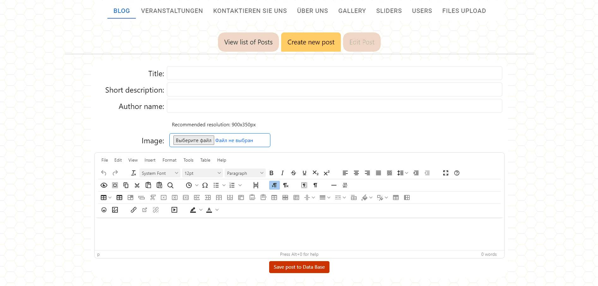

#  Imker app
*The project is a website platform for the beekeeping community in Germany. It comprises four main components: frontend, backend, PostgreSQL database, and utilizes Amazon S3 for object storage. All these components are encapsulated within a Docker container for convenient deployment and usage.*

## Technology Stack
<div style="display: flex; flex-wrap: nowrap; margin: 10px;">


</div>


Original repositories: [BACK](https://github.com/StopkinOlexandr/imker_back) | [FRONT](https://github.com/Andrii-Lytvyn/imker)


## Installation and Usage

### Requirements

To work with the project, you need to install Docker.

### Installation and Running

1. Clone the project repository:
   ```
   git clone https://github.com/VadimBJ/imker-app-docker.git
   ```

2. Navigate to the project directory:
   ```
   cd imker-app-docker 
   ```

3. Launch the Docker container:
   ```
   docker-compose up
   ```

After completing these steps, project should be accessible 
at http://localhost/imker/. 

### Authentication Data

#### *Administrator*
- Login: *boss@gmail.com*
- Password: *!Boss12345*

#### *Regular User*
- Login: *user@gmail.com*
- Password: *!Boss12345*

#### *Community Member*
- Login: *member@gmail.com*
- Password: *!Boss12345*


## Project Description

The project includes three user roles:

- **User:** Regular users have read-only access to the site. They can view all sections, update their personal information and avatar in their profile, but cannot leave comments or subscribe to community events.

- **Member:** Community members have the ability to write and delete (only their own) comments, as well as participate in community events.

- **Admin:** Community administrators have the ability to write and delete (any) comments, as well as participate in community events. They also have access to the administrative panel, providing full control over the site's content. There can be multiple administrators.

The platform is integrated with a Telegram Bot that sends notifications to the administrators' chat for specific events. The following events are supported:

- Registration of a new user
- User attempting to recover their password
- Requests from the feedback form

### Header

The Header contains a logo, navigation menu, and a Login button for authentication. Clicking on Login opens an authentication form with fields for entering email/password, as well as buttons for password recovery and new user registration.

Upon successful authentication, the Login button is replaced with the user's avatar and their name beneath it. Clicking on the avatar opens a contextual menu with a link to the user's profile and a button to log out.

### Footer

The Footer consists of three informative blocks:

- **Contacts:** Each field, when clicked, triggers a corresponding action.
- **Events:** Displays the latest relevant events (only those that have not yet occurred).
- **About Us:** Contains links to different sections of the website.

### Homepage

The homepage features:

- **Banner Slider:** Images are added through the admin panel. Swipe functionality is supported using either the mouse or screen touch.

- **"UNSERE MISSION" Block:** Contains a description of the community's mission, key goals, and values.

- **Sidebar with Articles:** Displays the four latest articles and a button to access all articles.

- **"HONIGSORTEN" Block:** Includes a visual representation of the main honey varieties with links to related articles.

- **"UNSER EXPERTENTEAM" Block:** Contains information about the community's "experts." Managed through the admin panel.

### BLOG Page

Managed through the admin panel, the Blog page includes:

- **Sidebar with a List of Current Community Events**

- **List of Available Articles with Pagination:**
   - Main photo of the article
   - Date of publication and author
   - Article title
   - Brief description

Clicking on the article title opens the full text on the POSTS page.

### POSTS Page

Includes:

- **Sidebar with a List of Current Community Events**

- **Full Text of the Article**

- **Comment Panel:**
    - Users with the "user" role only see existing comments. The panel for adding new comments is not displayed.
    - Users with the "member" role see existing comments and have a panel for adding comments. They can also delete their own comments.
    - Users with the "admin" role see existing comments and have a panel for adding comments. They can delete any of the existing comments.

### VERANSTALTUNGEN Page

Community events, both planned and past (managed through the admin panel). Includes:

- **List of Planned Events:**
    - Event date (with a smooth color effect)
    - Event title
    - Brief description
    - Event time
    - Event location address

- **Sidebar with a List of Past Community Events with Pagination**

- **Cube Slider:** Displays images from the community's photo gallery.

Clicking on the event title opens the "Events" page with its full description.

### Events Page

Includes:

- **Full Event Description:**
    - Event title
    - Event photo
    - Full description
    - Date and time of the event
    - Event location address
    - Interactive Google Map

- **Comment Panel:**
    - Users with the "user" role only see existing comments. The panel for adding new comments is not displayed.
    - Users with the "member" role see existing comments and have a panel for adding comments. They can also delete their own comments.
    - Users with the "admin" role see existing comments and have a panel for adding comments. They can delete any of the existing comments.

- **"Subscribe to the Event" Panel:**
    - Users with the "user" role only see a list of those already subscribed to the event; the "Participate in this event" button is not displayed.
    - Users with the "member" role see a list of those already subscribed and can subscribe/unsubscribe from the event.
    - Users with the "admin" role see a list of those already subscribed and can subscribe/unsubscribe from the event.

### UBER UNS Page

Community description (managed through the admin panel). Includes:

- **Community Description**

- **"OUR EXPERT TEAM" Block:**
    - Expert's photo
    - Position in the community
    - Full name
    - Brief description
    - Social media links

### GALERIE Page

Community photo gallery (managed through the admin panel). Includes:

- **Stylized Slider as Photo Cards:** Images are taken from the photo gallery.

- **Section Description**

- **Photo Gallery with Pagination:** Clicking on a photo opens a modal window with the full-size image.

### KONTAKT Page

Includes:

- **Community Contacts:**
    - Postal address
    - Phone number
    - E-mail
    - Interactive Google Map

- **Feedback Form:** Submitted inquiries are sent to the administrators' Telegram chat.

### User Profile page

Includes:

- **User Avatar and Name**

- **Community Member Badge:** Displayed only if the user has the "member" role.

- **User Information Block:**
    - E-mail
    - Phone number
    - Postcode (Postleitzahl)

- **Scheduled Events Block:** Displays events (with pagination) that the community member has subscribed to. There is also a unsubscribe button.

- **User Settings:** Here user can modify their personal information and avatar.

### Comments Panel

Contains a list of comments already written by community members, as well as a panel for adding new comments. Emoji insertion is available when writing comments.

- Users with the "user" role only see existing comments. The panel for adding new comments is not displayed.

- Users with the "member" role see existing comments and have a panel for adding comments. They can also delete their own comments.

- Users with the "admin" role see existing comments and have a panel for adding comments. They can delete any of the existing comments.

## ADMIN PANEL

### BLOG Tab

Capabilities:
- View a list of available posts with pagination.
- Edit a selected post.
- Create a new post.

To create a new post, enter the post title, a brief content summary, the author's name (optional), and upload a main image for the post. 
An editor with extensive functionality is integrated for post composition.




### VERANSTALTUNGEN Tab

Capabilities:
- View a list of available events with pagination.
- Edit a selected event.
- Create a new event.

### KONTAKTIEREN SIE UNS Tab

Capabilities:
- View and edit community contacts.
- View and edit the Google Map link.
- View and delete requests submitted through the feedback form.

### UBER UNS Tab

Capabilities:
- View a list of community experts.
- Edit the details of a selected expert.
- Delete a selected expert.
- Create a new expert.
- Edit the content of the "About Us" page.

### GALLERY Tab

Capabilities:
- Add new photos to the gallery.
- View a list of added photos with pagination.
- Delete a selected photo from the gallery.

### SLIDERS Tab

Images from this tab are used as banners on the homepage.

Capabilities:
- Add new banners to the homepage.
- View a list of added banners with pagination.
- Delete a selected banner.

### USERS Tab

Capabilities:
- View a list of registered users with pagination.
- Edit the details of a selected user.

### FILES UPLOAD Tab

Management of all uploaded files on the server.

Capabilities:
- Filter files by categories: all, avatar, event, gallery, post, slider, none.
  
  ** Files without a specified category or with an error are placed in the "none" category.

- View a list of existing files with pagination.

- Delete a selected file from the database and disk.


## License
This project is licensed under the terms of ___.

## Contacts
If you encounter issues or have questions related to this project, please contact me at ___.